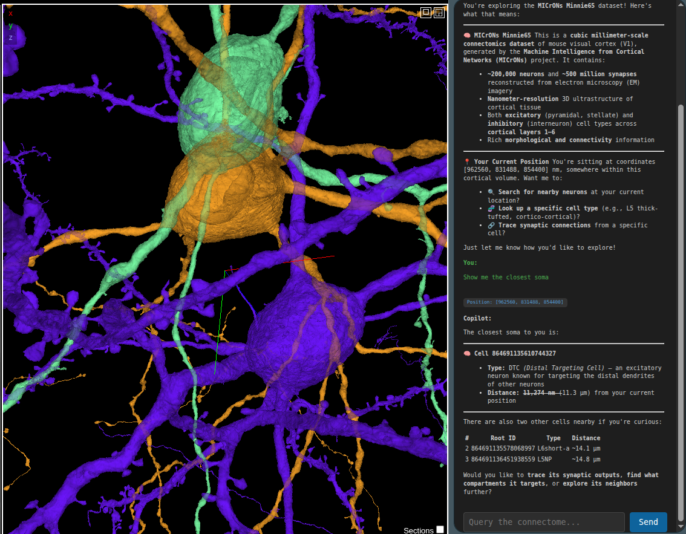
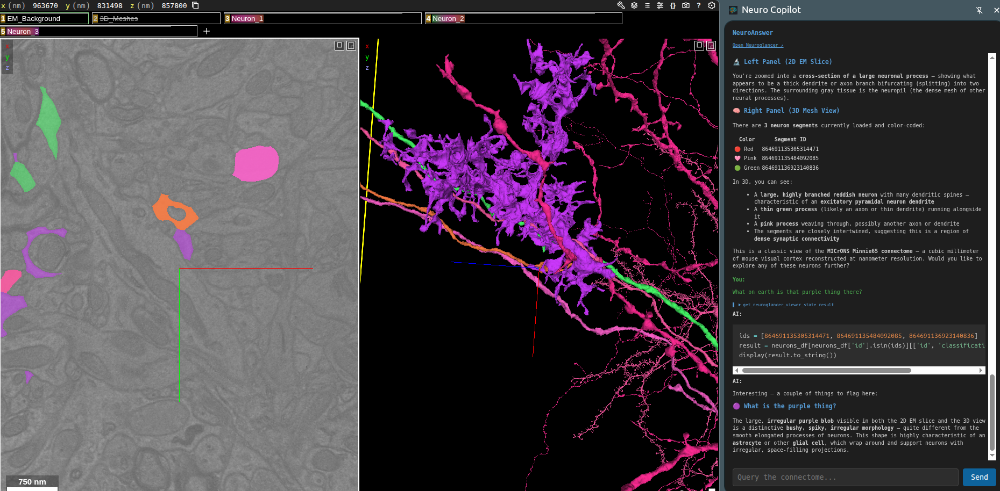
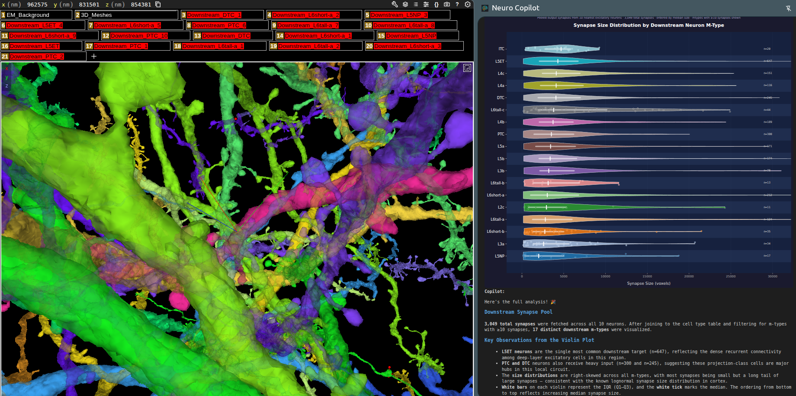
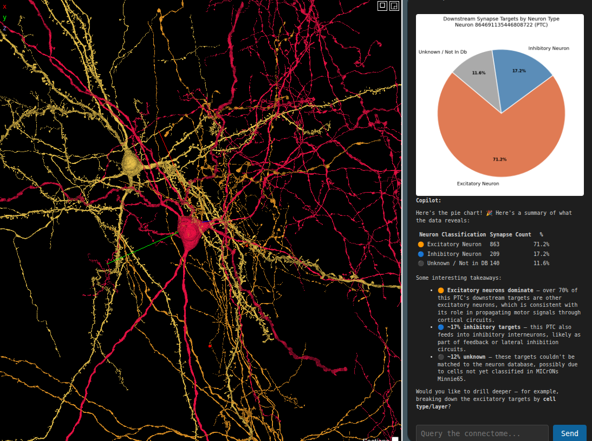
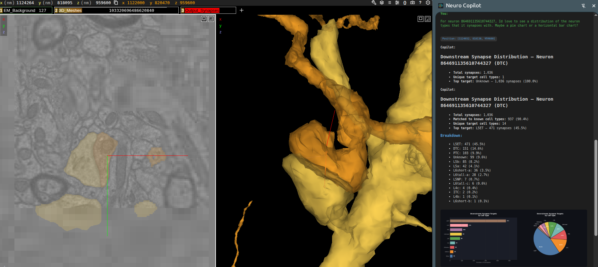

# NeuroAnswer

An AI copilot for exploring the [MICrONs Minnie65](https://www.microns-explorer.org/) connectome dataset. NeuroAnswer lets researchers query 200,000+ neurons and 500 million synapses using natural language, with results rendered directly in [Neuroglancer](https://github.com/google/neuroglancer).



## v2 Refactor — Claude Sees What You See

The v2 architecture makes a fundamental change: the Neuroglancer viewer is now controlled directly by the MCP server rather than being a separate browser session that the extension had to mirror state into. V1 used the chrome extension and javascript hacks to mutate the state. V2 hosts its own neuroglancer server locally and uses its existing python/websockets API to directly control it. This allows the development of pure MCP NeuroGlancer tools.

This also unlocks a capability that wasn't possible before!

### Claude as co-scientist

Claude can now take a screenshot of the active Neuroglancer viewport and interpret it visually — the same view the researcher is looking at, at the same moment. It can identify cell morphology, count visible structures, notice what's in the foreground vs background, and reason about what it sees before deciding what to query next. Combined with the CAVE tools, this closes a loop: observe → query → render → observe again.



*Claude identifying neurons, and what might be an astrocyte — from a live screenshot of the 3D mesh view.*

### What changed

| | v1                                                                                   | v2                                                                                                                                                                                      |
|---|--------------------------------------------------------------------------------------|-----------------------------------------------------------------------------------------------------------------------------------------------------------------------------------------|
| **Neuroglancer control** | Extension pushed state via URL hash                                                  | MCP server owns the `Viewer` object directly                                                                                                                                            |
| **Camera / layers** | Extension rewrote the browser URL                                                    | MCP tools call `viewer.txn()` server-side                                                                                                                                               |
| **Screenshots** | Not possible                                                                         | `viewer.screenshot()` returns rendered image; Claude sees it                                                                                                                            |
| **Auth** | Chrome cookie / Google OAuth popup                                                   | `MiddleAuthProvider` injects CAVE token server-side                                                                                                                                     |
| **Chat UI** | Chrome extension sidebar                                                             | Chrome extension sidebar (kept); Claude Desktop tested but doesn't render tool images. *Bonus* : Generated python code is now shown in the UI with syntax highlighting powered by prism |
| **Transport** | MCP over SSE                                                                         | MCP over SSE (unchanged); stdio available for Claude Desktop                                                                                                                            |
| **Neuroglancer URL** | Relied on public Neuroglancer servers / chrome extension had to detect the right tab | MCP server hosts its own local NeuroGlancer server                                                                                                                                      |

### Removed
- `nglui` scene URL construction (layers are now set directly on the viewer)
- Extension content script that polled and pushed `ng_state`
- FastAPI endpoints `/scenes` and `/new_scene` (replaced by `reset_neuroglancer_view` MCP tool)
- Layer / position / scene propagation through the relay response

---

## What it does

NeuroAnswer connects Claude to the [CAVE](https://caveclient.readthedocs.io/) connectomics database via an MCP (Model Context Protocol) server. Ask a question in plain English — "show me the closest soma" or "trace the downstream synapses of this L5 pyramidal cell" — and the system fetches the data, builds the 3D scene, and renders it in your Neuroglancer view.

**Current capabilities:**
- Spatial queries: find neurons by cell type within the current Neuroglancer viewport
- Synapse tracing: retrieve downstream synaptic targets for any neuron and render pre/post-synaptic markers
- **Code execution sandbox**: allowing Claude to run generated Python (pandas, numpy, matplotlib) workflows against the MICrONs dataset and render scientific figures in the browser

### Code execution sandbox

Ive created an MCP tool that allows Claude to generate and execute python against pre-loaded dataframes, allowing generic scientific queries. Scientific figures render directly in the chat window!

For example, the prompt

> Show me the 10 closest neurons in this field of view. Then for each of those neurons, query the API to find their downstream neurons. For that pooled set of synapses, render a horizontal violin plot showing the distributions of synapse size by the mtype of the downstream neuron

Produced the following analysis

> Downstream Synapse Pool
> 3,049 total synapses were fetched across all 10 neurons. After joining to the cell type table and filtering for m-types with ≥10 synapses, 17 distinct downstream m-types were visualized.
> #### Key Observations from the Violin Plot
> - L5ET neurons are the single most common downstream target (n=647), reflecting the dense recurrent connectivity among deep-layer excitatory cells in this region.
> - PTC and DTC neurons also receive heavy input (n=300 and n=245), suggesting these projection-class cells are major hubs in this local circuit.
> - The size distributions are right-skewed across all m-types, with most synapses being small but a long tail of large synapses — consistent with the known lognormal synapse size distribution in cortex.
> - White bars on each violin represent the IQR (Q1–Q3), and the white tick marks the median. The ordering from bottom to top reflects increasing median synapse size.
> - 464 synapses (~15%) hit neurons not in the cell-type table and were excluded as "Unknown".



## More examples





## In development

- Compartment targeting: identify synapses by postsynaptic compartment (soma, shaft, spine)
- Population search: look up excitatory and inhibitory neuron populations by morphological type
- **Richer annotation support**: line annotations connecting pre- and post-synaptic sites with size/weight labels

#### Future directions

- **Dataset generalization**: extending support to FlyWire, H01 (human cortex), and other connectomics datasets with different database schemas
- **Simplified architecture**: moving the full agent loop into the Chrome extension to eliminate the FastAPI relay
- **Community-driven tool design**: the tool vocabulary should be shaped by what researchers actually need — feedback on useful queries and workflows is very welcome

## Architecture

```
Chrome Extension (sidebar UI)
        ↕
FastAPI Gateway (relay server)
        ↕
MCP Server (FastMCP + CAVE client)
        ↕
CAVE / MICrONs Minnie65 cloud database
```

The MCP server exposes domain-specific tools — spatial search, synapse queries, scene construction — that Claude calls through the standard MCP protocol. A FastAPI gateway bridges the Chrome extension's HTTP requests to the MCP server. The extension injects a chat sidebar into the Neuroglancer interface and pushes returned scene state (layers, annotations, camera position) directly into the viewer.

Neuron metadata is cached locally as Parquet files to keep spatial queries fast. Synapse data is fetched live from CAVE on demand - a bit slower, but I'm working on it!


## Built with

Python · FastMCP · CAVEclient · nglui · FastAPI · Chrome Extensions API

## Installation

### 🔑 Server Setup & Data Access

To query the structural brain graph, you need a CAVE API token, along with your Anthropic API key.

1. Copy the environment template:
   `cp .env.example .env`
2. Go to the [DAF API Auth Portal](https://global.daf-apis.com/auth/api/v1/create_token). You may find this [additional documentation](https://tutorial.microns-explorer.org/quickstart_notebooks/01-caveclient-setup.html) useful.
3. Log in with your Google account.
4. Copy the generated token string.
5. Open your new `.env` file and paste your credentials:
   ```env
   ANTHROPIC_API_KEY=your_claude_key_here
   CAVE_TOKEN=your_copied_cave_token_here
   LANGFUSE_PUBLIC_KEY=optional_telemetry_key

Note, I'm using "LangFuse" to log my chats during development. If you want to do the same, you can
sign up for a free account, create API keys, and also place them in the .env file. 

With the credentials set up, the servers can be stood up using docker 
```bash
docker compose up
```

### Frontend setup

You can theoretically use the MCP server without NeuroGlancer, but it won't be fun. Science should be fun!
You'll need to install the Google Chrome extension for the fun part. Its not in the chrome extension store, but you can install it locally.

- In Google Chrome, type `chrome://extensions` in the URL bar and hit enter
- Enable `developer mode` with the toggle button
- Click `Load unpacked` and then navigate to the `chrome_extension` directory in this cloned repository
- When you open the extension, it will inform you if it doesn't see a NeuroGlancer tab, but it will list available datasets

## Feedback

This project is under active development. If you work in connectomics or neuroscience and have thoughts on what queries or workflows would be most useful in a natural language interface for Neuroglancer, please open an issue or reach out. The goal is to build something the field actually wants to use.


## Brainsplosion

Take a minute to reflect on the fact that, by using this tool, your biological neurons are creating language which informs a large set of in-silico neurons to create language that queries a database for information on a mouses biological neurons.

"We are a way for the universe to know itself" - Carl Sagan